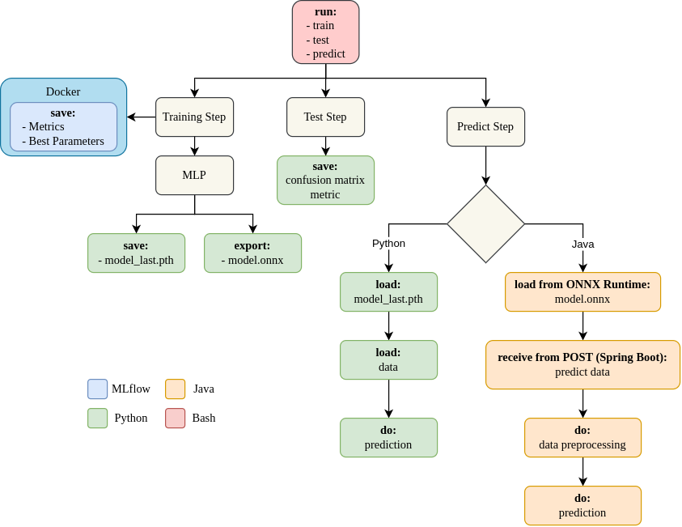
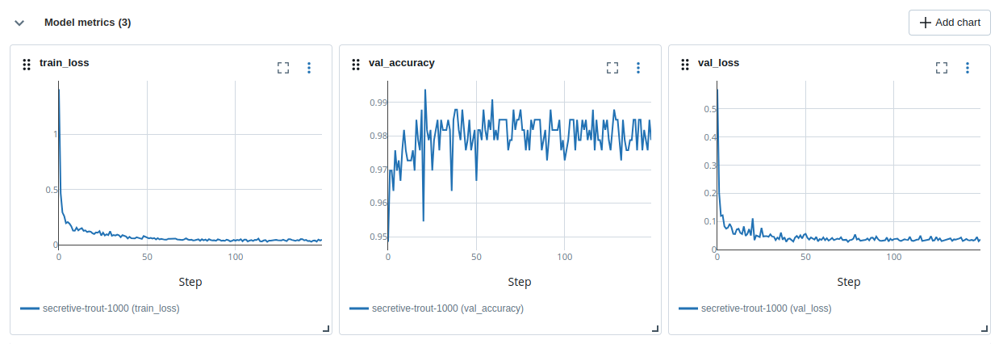
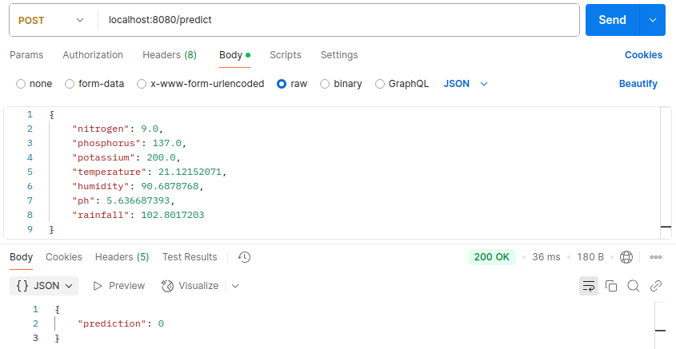
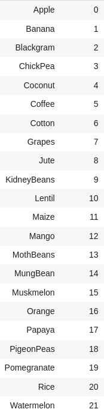
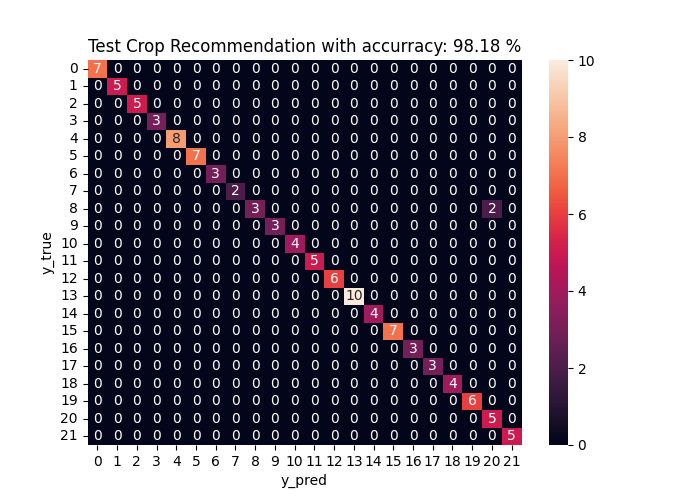

## AI-Powered Crop Prediction API with Java and ONNX Runtime
### Introduction
The best way to apply Machine Learning models is to integrate them with another applications, either in the Cloud or locally. This project is an example of how it can work. The model was trained using the `Crop Recommendation` dataset, which has 22 classes of different crops with 7 features (Nitrogen, Phosphorus, Potassium, Temperature, Humidity, pH and Rainfall).

### Project Structure

    

For create the model and train it, Python was used with `PyTorch` and, during the training step, the current runtime metrics and parameters were saved using `MLflow`. To export the models, ONNX Runtime was used and loaded by Java to make predictions via API, created with Spring Boot. Takes a look at the logs tracked by MLflow:

    

MLflow has several other features, but the purpose of this project is different.

### ONNX Runtime and Spring Boot
After the models (Multilayer Perceptron and MinMaxScaler) have been created and trained by Python, they were exported to type ONNX and moved to Java resources to be loaded by Java's ONNX Runtime library. First, the Spring Boot API must be working to receive the data, and then, pass it through the loaded scaler model (MinMaxScaler) and then the loaded Neural Network model, the response is the `index of the crop`. See:

    

See also the classes and their respective indexes:

    

### Run the project
Please, uses a Python virtual environment.

#### Python
In the `root` directory of the project:
1. $ `pip install -r requirements.txt`
2. $ `chmod +x run.sh`
3. $ `./run.sh train`
4. $ `./run.sh test`

#### Java
In the `backend` directory of the project (considering that the Java 21+ and Maven are already installed):
1. $ `mvn -DskipTests clean package`
2. $ `mvn exec:java -Dexec.mainClass="com.cardoso.backend.BackendApplication"`
3. Use `Postman` or `Curl` or `Insomnia` to create a POST requests and test the API

### Metrics
The following metrics were used to evaluate the model: Confusion Matrix and Accuracy (Test data was used).

    

